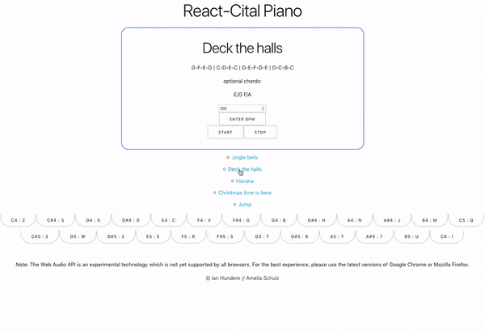
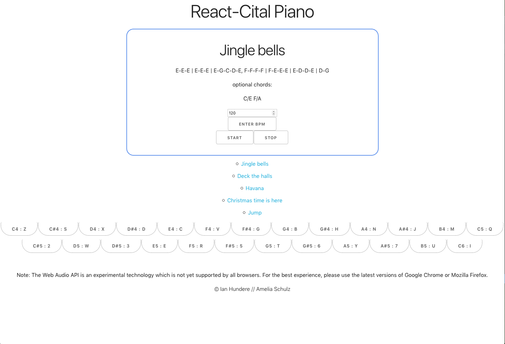

## React-Cital Piano

## Synopsis
A front-end synthesizer built using React and Tone.js. The user is given 2 octaves to play with as well as sheet music and a metronome to better help them understand music theory.

## Features
- 2 octave keyboard
- Keys controlled via mouse or QWERTY keyboard
- Each key held down lights up pink to inform the user what keys are pressed
- Metronome and sheet music to assist the user in learning music theory

## Successes
- The overall idea was quick to think of and we managed to untangle much of the logic necessary for executing it to MVP
- We managed to incorporate a number of things that were not initially thought up during our wireframe phase (e.g. sheet music, metronome, etc)

## Challenges
- Binding note values to QWERTY keys
- Controlling Note Off messages using the keyboard
- Tracking state for keydown presses that allows keys to light up depending on if they're pressed

## Node Dependancies
- [React](https://www.npmjs.com/package/react)
- [Tone.js](https://tonejs.github.io)

## Future Features
- Touch capability for phones and tablets
- Record notes for playback

## Team Members
- Ian Hundere - [GitHub](https://github.com/ianhundere)
- Amelia - [GitHub](https://github.com/Amelia678)
